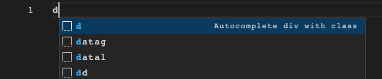

# README

This extension adds HTML attribute auto completion and suggestions for erb files. 

It also adds some snippets for quickly creating divs with the class attribute. It will also drop the cursor in the approprite position or in the case of using a snippet, you can quickly tab from the class to the inside of the div. 

## Features
- When adding a `
` in an erb file, start typing the attribute name and it will auto-complete the attribute with open and closing double quotes. 
- Type "d", "dc", or "<d" to insert `

`. You can tab from the class to the inner div content. 

## Release Notes

**Adds the basics:** 
- auto complete for attributes
- a snippet to quickly generate a div

### 0.0.1

Initial release of the erb attribute autocomplete extension
